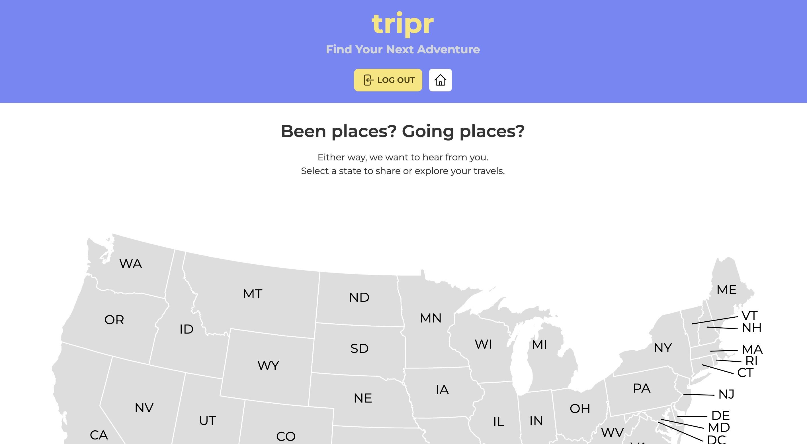

# tripr.com | Find Your Next Adventure

We the Code Slackers have conceived and executed a design to make travel to cities across the U.S. more accessible to folks who are ready for an adventure.

Introducing the tripr travel platform. With this platform, users (aka triprs) can explore or share the hidden gems of travel destinations based on user-generated content features. From the latest restaurants to vetted transportation options, every tripr can be set up for success during their travels.

## The Development

In creating our first collaborative MERN-stack single-page application, we've combined a scalable MongoDB backend, a GraphQL API and an Express.js and Node.js server with a React front end—implementing user authentication with JWT to build a user-focused platform.

Additional dependencies and tools we used include Cloudinary for our image upload feature and daisyUI for a more efficient use of Tailwind CSS components.

Building on agile development methodologies, we aligned on best practices to store our project code in GitHub, managed our workstream via Trello and implemented feature and bug fixes using the Git branch workflow and pull requests.

## Acceptance Criteria

IF someone visits the tripr site 
THEN they are prompted to sign up or log in before engaging

IF a user selects one of the states on the homepage's map of the US 
THEN they can view a list of the selected state's cities where other triprs have made travel plans or add a new city

IF a user adds a new city 
THEN they can specify the city's name and state and upload an image of that city

IF a user selects a listed city 
THEN they can share their own trip highlights to that city or check out highlights from other triprs

IF a user shares their own trip 
THEN they can add their own Food, Transportation, Things To Do & Lodging highlights

IF a user explores another tripr's highlights 
THEN they can access a pre-populated set of Food, Transportation, Things To Do & Lodging highlights they can update

IF a user adds a new trip highlight 
THEN they can add that highlight's details to the site database

## Check It Out

[Visit tripr.com today](https://tripr.herokuapp.com)
